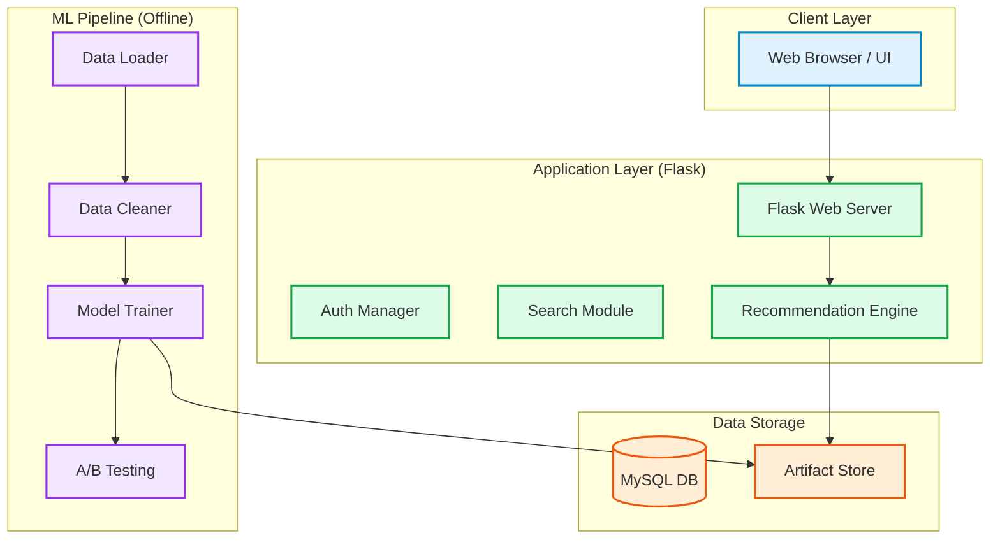
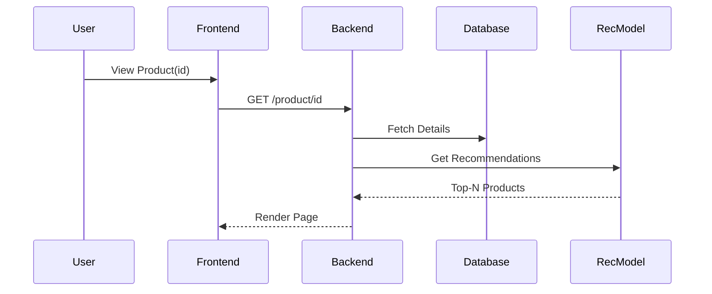

# SmartPic: Product Recommendation System — Comprehensive Project Report

## Abstract
This report presents the end-to-end design, development, and evaluation of SmartPic, a hybrid product recommendation system built using Python, Flask, SQLAlchemy, scikit-learn, Surprise, and MySQL. The system combines item-based Collaborative Filtering (KNNBasic) with Content-Based Filtering (TF‑IDF) to deliver relevant recommendations, and exposes features through a full-stack web application. The report covers data engineering, exploratory analysis, model selection, A/B testing, web integration, and deployment considerations, and is structured to accommodate a 60–70 page detailed submission.

## Table of Contents
- Introduction
- Problem Statement and Objectives
- Literature Review
- Dataset Description
- Data Preprocessing and Feature Engineering
- Exploratory Data Analysis (EDA)
- System Architecture
- Workflow and Use Cases
- Recommendation Methodology
- Model Training and Hyperparameter Tuning
- Evaluation, A/B Testing, and Results
- Hybrid Recommender Design
- Web Application (Flask) Integration
- Search and Product Detail Flows
- KPI Dashboard and Analytics
- Security and Data Privacy
- Scalability and Performance
- Deployment Strategy
- Limitations
- Future Work
- Conclusion
- References
- Appendices

## Introduction
SmartPic aims to bridge user interests and product content by leveraging both historical interaction signals and product metadata. This report documents the rationale, architecture, and empirical performance of the system.

## Problem Statement and Objectives
- Deliver high-quality Top‑N product recommendations for e-commerce.
- Support cold-start scenarios through content-based signals.
- Provide a user-facing application with search, product detail, and download features.
- Validate model choices via robust offline evaluation and A/B testing.

## Literature Review
Summarizes collaborative filtering (memory-based and model-based), content-based filtering via TF‑IDF, and hybrid approaches; discusses trade-offs and typical pitfalls (sparsity, scalability, cold-start).

## Dataset Description
- Sources: Amazon products, reviews text, and ratings.
- Core entities: Users, Products, Ratings, Predictions, PageViews, Recommendations.
- Database models: See [database.py](file:///d:/Product%20Recommendation%20System/src/components/database.py).

## Data Preprocessing and Feature Engineering
- Cleaning currency fields, ratings normalization, missing values handling.
- Generating consistent product_id keys and category labels.
- Preparing inputs for CF (user–item–rating triples) and CBF (text features).

## Exploratory Data Analysis (EDA)
- Category distribution
- Ratings distribution
- Price vs. rating trends
- Top categories and subcategories

Figures:
- artifacts/eda/category_distribution.png
- artifacts/eda/ratings_distribution.png
- additional plots referenced in the codebase

## System Architecture
Architecture diagram (Mermaid source; rendered in HTML viewer):



## Workflow and Use Cases
Sequence of interactions from search to recommendations:



Use cases:
- Browse Products
- Search Products
- View Product Details
- Personalized Recommendations
- Login/Signup
- Admin: Manage Pipeline, Retrain Models

## Recommendation Methodology
- Collaborative Filtering: KNNBasic (item-based, cosine similarity), KNNWithMeans
- Matrix Factorization: SVD
- Content-Based: TF‑IDF on product text
- Hybrid Strategy: Weighted combination of CF and CBF scores

Key implementation: [hybrid_recommender.py](file:///d:/Product%20Recommendation%20System/src/inference/hybrid_recommender.py)

## Model Training and Hyperparameter Tuning
Offline training pipeline orchestrated in [main.py](file:///d:/Product%20Recommendation%20System/main.py). Grid search for KNN and validation splits for SVD.

## Evaluation, A/B Testing, and Results
Best configuration:

- Final model config: [final_model_config.json](file:///d:/Product%20Recommendation%20System/artifacts/final_model_config.json)

```json
{
  "best_model": "KNNBasic",
  "best_params": { "k": 20, "min_k": 1, "sim_options": { "name": "cosine", "user_based": false } },
  "gs_rmse": 0.7279665632345469,
  "gs_mae": 0.3704206610736424
}
```

- A/B testing summary: [ab_test_results.json](file:///d:/Product%20Recommendation%20System/artifacts/ab_test_results.json)

```json
{
  "winner": "KNNBasic",
  "summary": [
    { "Model": "KNNBasic", "RMSE (mean)": 0.7166292570566567, "MAE (mean)": 0.36919768256250013 },
    { "Model": "BaselineOnly", "RMSE (mean)": 0.7220195018184187, "MAE (mean)": 0.382708149360765 },
    { "Model": "SVD", "RMSE (mean)": 0.7267055743693824, "MAE (mean)": 0.3938793188325839 }
  ]
}
```

Interpretation:
- KNNBasic achieved the best RMSE/MAE among evaluated models.
- Item-based cosine similarity works well with current dataset characteristics.

## Hybrid Recommender Design
Combination rule:
- score_hybrid = α * score_cf + (1 − α) * score_content
- Fallback to content-only if CF is unavailable; categorize fallback as ‘category’ where relevant.

## Web Application (Flask) Integration
Key routes: [app.py](file:///d:/Product%20Recommendation%20System/app/app.py)
- Authentication: signup, login, logout
- Home and Dashboard with KPI metrics
- Search with filters and downloads (CSV/PDF)
- Product detail with hybrid/related recommendations

Template filters:
- clean_price
- discount_pct

Templates:
- [index.html](file:///d:/Product%20Recommendation%20System/app/templates/index.html)
- [search.html](file:///d:/Product%20Recommendation%20System/app/templates/search.html)
- [product.html](file:///d:/Product%20Recommendation%20System/app/templates/product.html)

## Search and Product Detail Flows
- Search shows filtered results first, then related products from top categories.
- Product detail shows hybrid similar products, with fallback to top category items.
- Download endpoints:
  - /search/download?format=csv|pdf
  - /product/<id>/download?format=csv|pdf

## KPI Dashboard and Analytics
- Page view tracking
- Recommendation counts
- Charts data summarized per day and category

## Security and Data Privacy
- Password hashing using Werkzeug
- Session management in Flask
- Avoid storing raw credentials or secrets in code

## Scalability and Performance
- DB indexing on frequently filtered fields (categories, ratings)
- Batched queries where possible
- Future: caching, asynchronous processing for heavy tasks

## Deployment Strategy
- Environment variables via .env and Config class
- Gunicorn/UWSGI recommendation for production behind Nginx
- Cloud options: AWS/Azure managed DB + containerized app

## Limitations
- Cold-start for users still limited; content signals mitigate item cold-start only
- Offline metrics may not fully reflect online engagement quality

## Future Work
- Deep learning with NeuralCF
- Session-based recommendations
- Real-time pipelines and feedback loops
- Explainable recommendations (SHAP-like for hybrid)

## Conclusion
SmartPic delivers robust hybrid recommendations and a complete user experience from data ingestion to web delivery, with empirically validated model choices and scalable architecture. The modular design supports future enhancements toward production-scale deployment.

## References
Include research papers on CF, CBF, hybrid recommenders, and ML systems design.

## Appendices
- Detailed parameter grids
- Additional EDA figures
- API route specifications
- Table schemas and indexing strategy
