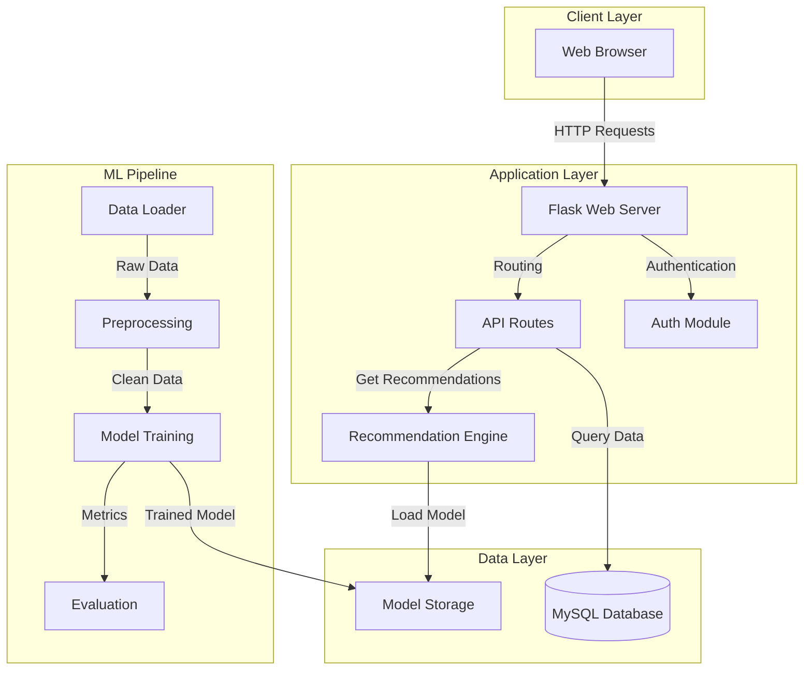
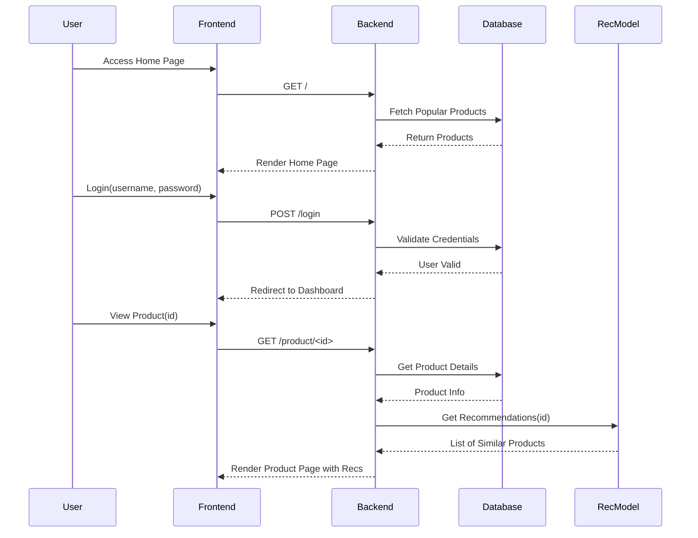
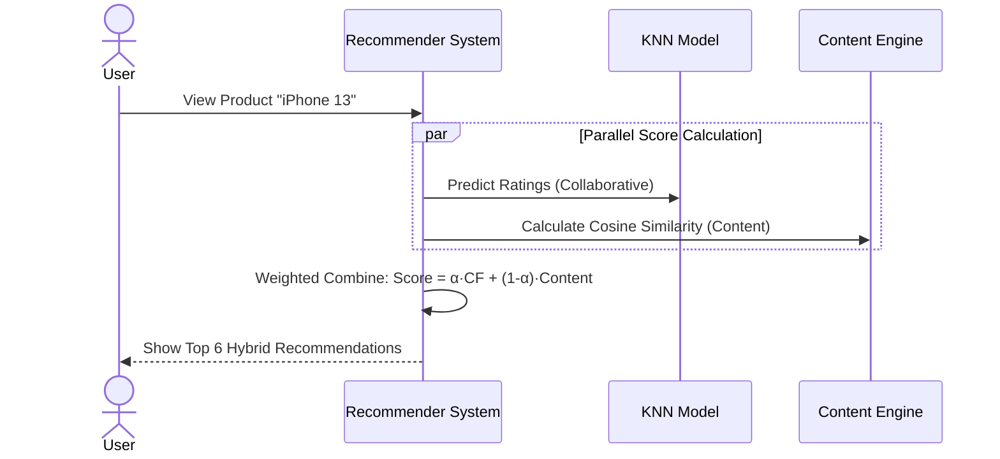
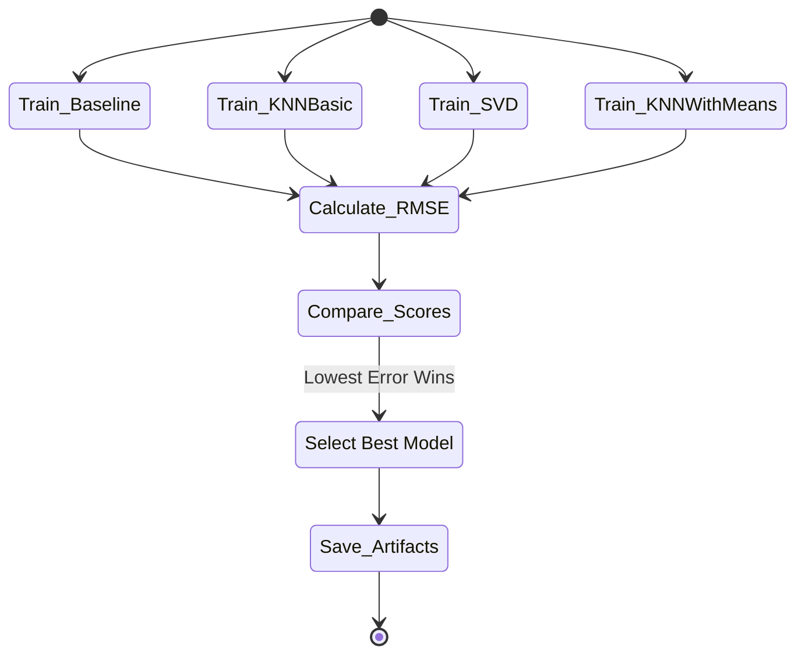

# System Diagrams

The following diagrams illustrate the architecture, workflow, and use cases of the Product Recommendation System.

## 1. System Architecture



## 2. Workflow Diagram



## 3. Use Case Diagram

```mermaid
usecaseDiagram
    actor "Registered User" as User
    actor "System Admin" as Admin
    
    package "Product Recommendation System" {
        usecase "Browse Products" as UC1
        usecase "Search Products" as UC2
        usecase "View Product Details" as UC3
        usecase "Get Personalized\nRecommendations" as UC4
        usecase "Login/Signup" as UC5
        usecase "View Dashboard" as UC6
        usecase "Manage Data Pipeline" as UC7
        usecase "Retrain Models" as UC8
    }

    User --> UC1
    User --> UC2
    User --> UC3
    User --> UC4
    User --> UC5
    User --> UC6

    Admin --> UC5
    Admin --> UC7
    Admin --> UC8
```

---

## 4. Sequence Diagram (User Request)
**Description:** What happens precisely when a user asks for a recommendation.



---

## 5. Model Selection Logic (The Tournament)
**Description:** How the system decides which model is best.


