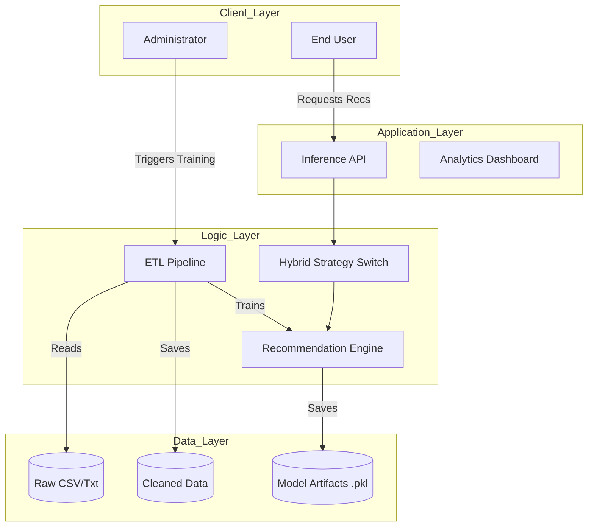
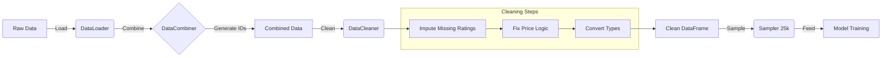
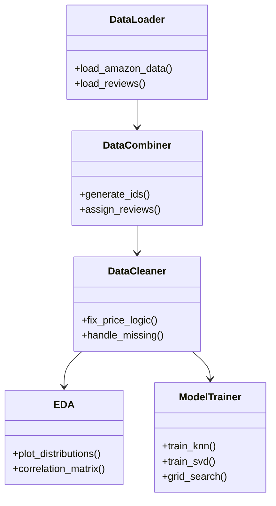
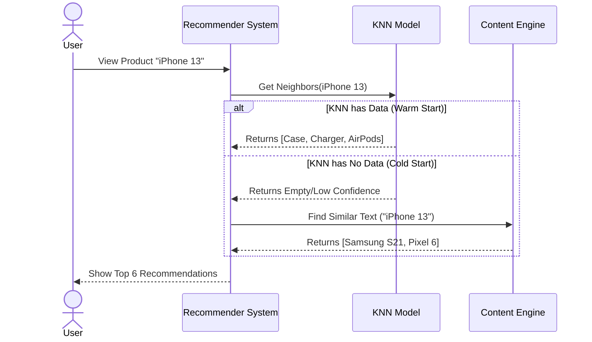
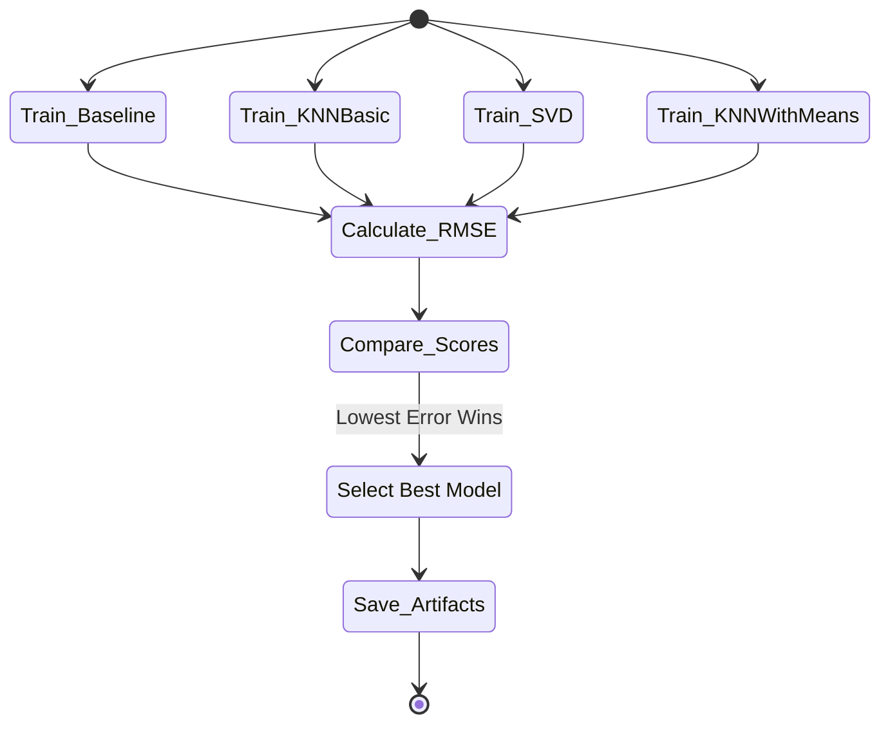

# 📊 Mermaid Diagrams for Product Recommendation System

Use these codes to generate professional diagrams for your report or presentation.

---

## 1. System Architecture (High Level)
**Description:** Shows the 4 main layers of the application.

---

## 2. Data Processing Workflow (ETL)
**Description:** The detailed steps from Raw Data to Training.

---

## 3. Class Diagram (Code Structure)
**Description:** How your Python classes relate to each other.

---

## 4. Sequence Diagram (User Request)
**Description:** What happens precisely when a user asks for a recommendation.

---

## 5. Model Selection Logic (The Tournament)
**Description:** How the system decides which model is best.

